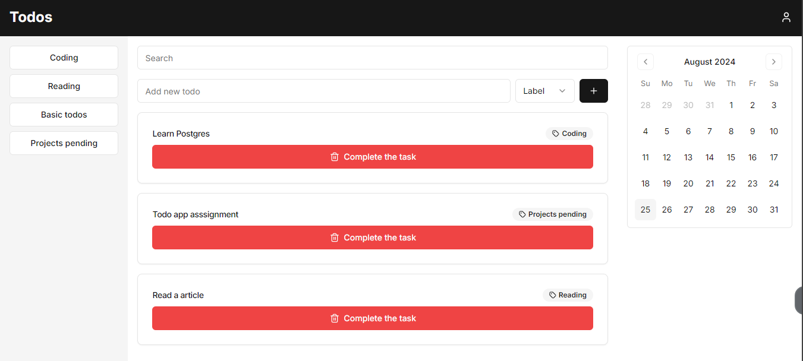

# Writix task

## Setup Instructions

1. Clone this repository `https://github.com/notcodesid/todos`
2. Install dependencies: `npm install` or `yarn install`
3. Run the development server: `npm run dev` or `yarn dev`
4. Open [http://localhost:3000](http://localhost:3000) in your browser

## Approach and Assumptions

This project implements a responsive dashboard using Next.js and React with TypeScript. The main components include:

- MainContent: The core component managing the todo list and overall layout
- Sidebar: A reusable component for desktop navigation
- AddTodo: Component for adding new todo items
- CalendarSection: Placeholder for calendar functionality
- SheetSide and SheetDemo: Mobile-friendly navigation components

Key assumptions:
- The todo list serves as a placeholder for the "main content area" mentioned in the requirements
- The sidebar options are represented as labels for the todo items
- Mobile responsiveness is handled through conditional rendering and CSS classes

## Code Organization

The code is structured into reusable components, with the main logic centralized in the MainContent component. State management is handled using React hooks, allowing for easy updates and filtering of todo items.

## Responsiveness

The layout adapts to different screen sizes:
- Desktop: Full sidebar visible
- Mobile: Sidebar replaced with SheetSide component for space efficiency

## Creative Solutions

1. Combined search and label filtering for efficient todo management
2. Implemented a toggle mechanism for label selection in the sidebar
3. Used a card-based layout for todo items to improve readability and interaction